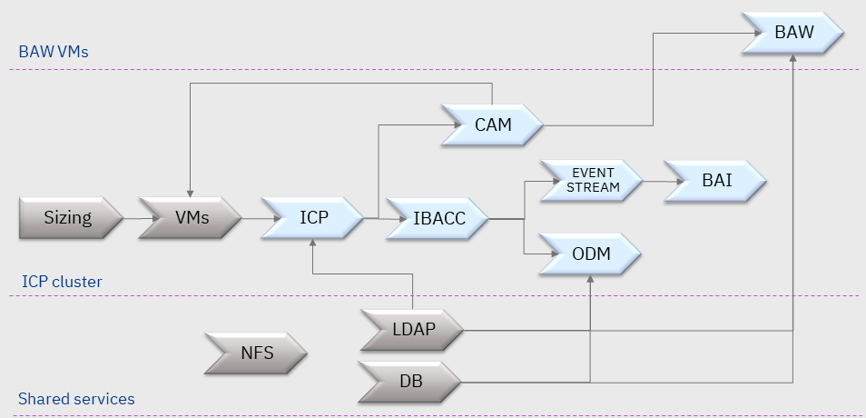

# IBM Cloud Pak for Automation deployment scripts

This repository provides a number of Ansible scripts to:
- Install ICP as the container management platform for the Cloud Pak
- Deploy the different components of the Cloud Pak

Check-out the [denim-compute](https://github.com/ibm-cloud-architecture/denim-compute) sister repository for the reference implementation of the IBM Cloud Pak for Automation.

---

## Install Ansible
You will need [Ansible](https://www.ansible.com/) installed to run the install and deployment scripts.
You can use the simple [Ansible installation script](https://github.ibm.com/CASE/icp4a-deployment/blob/master/icp/install-ansible.sh) to set it up on the VM from which you'll run the scripts.

---

## Install ICP4A on ICP
Install and deployment for the components in blue on the dependency diagram below are addressed by the scripts under the `icp` directory:

---

We plan to address more container management platforms, in particular OpenShift in the future.
